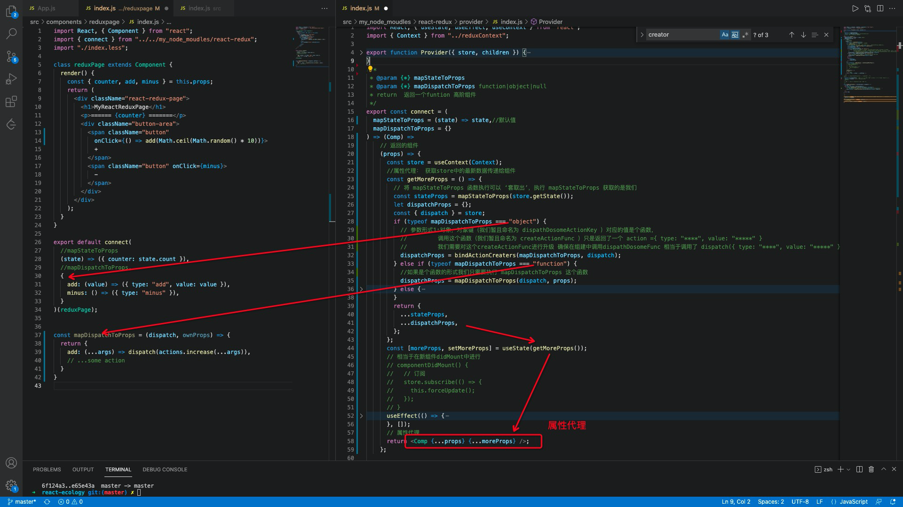

# 仿写react-router && react-redux 

## react-router

- 核心设计思路：
  -  BrowserRouter： 通过  CreateContext （Provider->Consumer ） 的方式将history 对象传递给子组件 ，并且BrowserRouter 组件自身监听 history 的变化而后setstate 就可以实现子组件的重新渲染匹配
  - Link： 本质上就是一个 a标签（但是被阻止了默认行为，他的作用就是通过 Consumer 的方式获取到BrowserRouter父组件传递过来的 history 对象当我们click时候进行 push 操作，这样就会被 BrowserRouter所感知（history.listen） 触发上面的过程
  - Switch： 对其内部包裹的各个 Route 组件进行 React.Children.forEach 并且找到与当前路径匹配的Route 组件进行React.cloneElement 复制生成一个一个reactElement，如果没有找到 展示 404 默认页面。
  - Route 按照  chilidren > component >render 的顺序决定调用那个props 最后展示页面。
    - 需要考虑两种情况
      - 被Switch 包裹：这样的话实际只有一个 Route 组件被实力化（不管是否与路由匹配）一些匹配路由的逻辑Switch已经完成。
      - 没有被 Switch 包裹：那么所有的 Route 条目都会被实力化，Route 内部需要自己进行一下逻辑判断，只有与路由匹配的实例 才可以展示。其他展示 null
- TODO
  - 没有 Switch 包裹的Route 不能实现 404 页面的展示。似乎可以通过redirect 实现

- component配置项允许我们传递进去函数，但是每次上层组件（也可以是这个Route组件被引用的组件）的状态发生改变的时候。这个 child组件都会不断的进行挂载和卸载。

  - 渲染component的时候会调用 react.creatElement 如果使用下面这种匿名尖头函数的方式 导致生成组件的type总是不同的，所以会重复的挂载和卸载。

  

  所以更加的推荐在使用render api的时候 传递函数

  

- 经典面试题 history 和 hash 路由的区别

  > https://www.cnblogs.com/HappyYawen/p/14251578.html

  1. 形式不同： 一个是 “#/path” 一个就是普通的路径

  2. 实现原理不同：

      hash 路由是通过浏览器监听hashchange事件，在回调函数中获取到 window.location.hash 的值，做到对应的hash路由和UI的对应。

     history 路由是通过 H5 的 history api来修改浏览器的历史记录。具体的话是使用了 新增的  pushState() 和 replaceState() 方法

  3.  是否需要后端的支持：hash 路由并不会被浏览器发送给服务器，但是histoy会在我们刷新页面的时候真正的访问后端定义的路由，所以需要服务端的支持 否则会 404。

     

## react-redux 

- 核心思路

  - 大前提：数据的传递， 依赖于生产/消费者模式  Provider  Consumer

  - 线路一：connect 高阶组件（属性代理）目的产出的新组件除了有之前的能力以外还获取到了

    - store中的对应数据字段（mapStateToProps）

      

    

    - 获取到了改变store 数据状态的方法dispatch({\*\****})。

      	

      - 向 store的监听者数组中添加自己的处理函数，确保只要store的数据状态一改变，我就执行上面的两个动作。从而实现获取到最新的store数据并进行更新

  - 线路2:store 的实现

    - 发布订阅方式

      订阅

      

      发布

      

